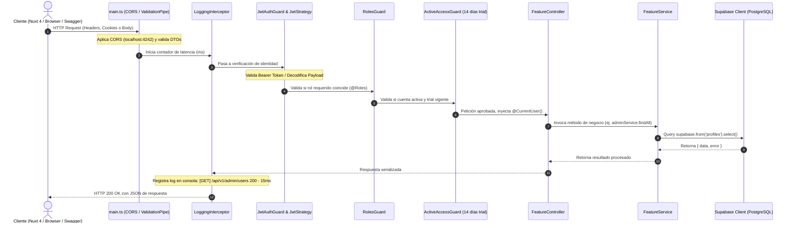

# 📘 Guía Maestra de Arquitectura y Desarrollo: Proyecto "Vamos Aprendiendo Web"

Este documento contiene el análisis técnico detallado del proyecto, su arquitectura tanto en el **Backend (NestJS 11)** como en el **Frontend (Nuxt 4 / Vue 3)**, el flujo de datos integral, el estado actual de la autenticación por Cookies y su guía de implementación, y las guías paso a paso para crear **Componentes, Páginas, Módulos y Guards**.

---

## 📑 Tabla de Contenidos
1. [Visión General y Stack Tecnológico](#1-visión-general-y-stack-tecnológico)
2. [Estructura de Carpetas y Responsabilidad de Cada Una](#2-estructura-de-carpetas-y-responsabilidad-de-cada-una)
3. [Flujo de Ejecución de una Petición (Request Lifecycle End-to-End)](#3-flujo-de-ejecución-de-una-petición-request-lifecycle-end-to-end)
4. [Análisis de Cookies: ¿Ya las usamos? ¿Cómo implementarlas?](#4-análisis-de-cookies-ya-las-usamos-cómo-implementarlas)
5. [Guía de Desarrollo Frontend (Nuxt 4 / Vue 3): Componentes y Pages](#5-guía-de-desarrollo-frontend-nuxt-4--vue-3-componentes-y-pages)
6. [Guía de Desarrollo Backend (NestJS 11): Módulos y Guards](#6-guía-de-desarrollo-backend-nestjs-11-módulos-y-guards)
7. [Cómo Consumir los Servicios del Backend desde el Frontend](#7-cómo-consumir-los-servicios-del-backend-desde-el-frontend)
8. [Buenas Prácticas y Reglas del Proyecto](#8-buenas-prácticas-y-reglas-del-proyecto)

---

## 1. Visión General y Stack Tecnológico

El ecosistema de **Vamos Aprendiendo Web** es una plataforma educativa orientada a tutores, estudiantes y administradores. Está diseñada bajo una arquitectura desacoplada y robusta:

- **Backend:**
  - **Framework:** NestJS 11 (plataforma Express, TypeScript).
  - **Base de Datos & BaaS:** Supabase (PostgreSQL con Auth, RLS y Storage).
  - **Autenticación:** Passport JWT + Refresh Token Rotation (RTR) con hashing seguro SHA-256 en base de datos.
  - **Validación de Datos:** `class-validator` + `class-transformer` con `ValidationPipe` estricto (`whitelist`, `forbidNonWhitelisted`, `transform`).
  - **Documentación:** Swagger / OpenAPI interactivo en `/api/docs`.
  - **Pruebas:** Jest (`.spec.ts`) para pruebas unitarias de servicios, controladores y guards.
  - **Seguridad:** Control de Acceso Basado en Roles (RBAC: `admin`, `usuario`, `test`) y Guard de periodo de prueba de 14 días (`ActiveAccessGuard`).

- **Frontend:**
  - **Framework:** Nuxt 4 / Vue 3 con Composition API (`<script setup lang="ts">`).
  - **Consumo API:** `$fetch`, `useFetch`, `useAsyncData` y composables reactivos (`useApi`, `useAuth`).
  - **Estilos:** TailwindCSS / CSS moderno.

---

## 2. Estructura de Carpetas y Responsabilidad de Cada Una

### 📂 Backend (`/backend`)

```text
backend/
├── .agents/                 # Habilidades y agentes de automatización para desarrollo
│   └── skills/              # Skills para generación de módulos NestJS, pruebas y frontend Nuxt
├── database/                # Scripts SQL y migraciones de Supabase / PostgreSQL
│   └── migrations/          # Migraciones versionadas (ej. 20260821_roles_and_trial_setup.sql)
├── src/                     # Código fuente principal de la aplicación NestJS
│   ├── common/              # Elementos compartidos transversales a toda la app
│   │   ├── decorators/      # Decoradores personalizados (@CurrentUser, @Roles)
│   │   ├── enums/           # Enumeraciones de dominio (Role: admin, usuario, test)
│   │   ├── guards/          # Guards de seguridad (JwtAuthGuard, RolesGuard, ActiveAccessGuard)
│   │   └── interceptors/    # Interceptores HTTP (LoggingInterceptor con cálculo de latencia)
│   ├── modules/             # Módulos de funcionalidad de negocio
│   │   ├── admin/           # Gestión de usuarios por el administrador (CRUD, filtros, extensión trial)
│   │   │   ├── dto/         # DTOs de consulta, actualización de perfil, email y trial
│   │   │   ├── admin.controller.ts
│   │   │   ├── admin.service.ts
│   │   │   └── admin.module.ts
│   │   ├── auth/            # Autenticación, registro, OAuth y rotación de tokens
│   │   │   ├── dto/         # DTOs (LoginDto, RegisterDto, OAuthLoginDto, RefreshTokenDto)
│   │   │   ├── strategies/  # Estrategias Passport (JwtStrategy)
│   │   │   ├── auth.controller.ts
│   │   │   ├── auth.service.ts
│   │   │   └── auth.module.ts
│   │   ├── supabase/        # Conexión centralizada con cliente Supabase (PostgreSQL)
│   │   │   ├── supabase.service.ts
│   │   │   └── supabase.module.ts
│   │   └── telemetry/       # Registro y monitoreo de eventos / métricas
│   ├── app.controller.ts    # Controlador raíz (Health check de la app)
│   ├── app.module.ts        # Módulo raíz que ensambla todos los submódulos y servicios globales
│   ├── app.service.ts       # Servicio base
│   └── main.ts              # Punto de entrada (bootstrap), CORS, Swagger y Pipes globales
├── test/                    # Pruebas End-to-End (E2E)
├── .env                     # Variables de entorno locales (NO versionar)
├── package.json             # Dependencias y scripts de ejecución
└── tsconfig.json            # Configuración de TypeScript
```

### 📂 Frontend (`/frontend`) (Arquitectura Nuxt 4)

```text
frontend/app/
├── assets/                  # Estilos globales (CSS, fuentes, gráficos vectoriales)
├── components/              # Componentes Vue 3 reutilizables
│   └── ui/                  # Componentes base atómicos (Button, Input, Modal, Card)
├── composables/             # Hooks reactivos (useAuth.ts, useApi.ts, useTrial.ts)
├── middleware/              # Guards de navegación de rutas (auth.ts, role.ts)
├── pages/                   # Enrutamiento automático basado en archivos
│   ├── index.vue            # Landing page / Home
│   ├── login.vue            # Página de inicio de sesión
│   ├── register.vue         # Página de registro
│   └── dashboard/           # Rutas privadas protegidas
│       ├── index.vue
│       └── admin.vue
└── layouts/                 # Plantillas de diseño estructural (default.vue, auth.vue)
```

---

## 3. Flujo de Ejecución de una Petición (Request Lifecycle End-to-End)

El siguiente diagrama muestra el recorrido exacto de una petición desde el navegador o cliente HTTP hasta la base de datos y su respuesta:



---

## 4. Análisis de Cookies: ¿Ya las usamos? ¿Cómo implementarlas?

### 🔍 ¿Ya usamos Cookies actualmente en el proyecto?
> [!IMPORTANT]
> **Respuesta:** **NO en el Backend.** Actualmente el backend **no** gestiona ni almacena tokens en cookies HTTP.
> 
> - En `AuthController`, las respuestas de `/login`, `/register` y `/refresh` devuelven los tokens en el cuerpo JSON:
>   ```json
>   {
>     "accessToken": "eyJhbGciOi...",
>     "refreshToken": "...",
>     "user": { ... }
>   }
>   ```
> - En `JwtStrategy`, la extracción se realiza exclusivamente desde el header de autorización:
>   `ExtractJwt.fromAuthHeaderAsBearerToken()`
> - `cookie-parser` **no** está instalado en el `package.json` del backend.
> - En el frontend (`nuxt4-feature-builder`), se utiliza `useCookie('auth_token')` únicamente como almacenamiento en el cliente para luego inyectarlo manualmente en la cabecera `Authorization: Bearer <token>`.

---

### 🛡️ ¿Por qué es recomendable usar Cookies `HttpOnly`?
Almacenar tokens en `localStorage` o cookies accesibles por JavaScript deja al usuario vulnerable a ataques **XSS (Cross-Site Scripting)**. Al usar cookies `HttpOnly`, el navegador las envía automáticamente en cada petición y ningún script de terceros puede leerlas.

---

### 🚀 Guía Paso a Paso para Implementar Cookies `HttpOnly` en el Backend

#### Paso 1: Instalar `cookie-parser`
Ejecuta en la terminal del backend:
```bash
npm install cookie-parser
npm install -D @types/cookie-parser
```

#### Paso 2: Habilitar el middleware en `src/main.ts`
Modifica `src/main.ts` para registrar `cookie-parser` y asegurar que CORS permita credenciales:

```typescript
// src/main.ts
import cookieParser from 'cookie-parser';

async function bootstrap() {
  const app = await NestFactory.create(AppModule);

  // 1. Activar lectura de cookies en las solicitudes entrantes
  app.use(cookieParser());

  // 2. Permitir el envío de cookies desde el Frontend
  app.enableCors({
    origin: process.env.FRONTEND_URL || 'http://localhost:4242',
    credentials: true, // ¡Obligatorio para que el navegador guarde cookies de otro puerto/dominio!
  });

  // ... resto de la configuración
}
```

#### Paso 3: Configurar Extracción Dual en `src/modules/auth/strategies/jwt.strategy.ts`
Permite que el sistema acepte tokens **tanto** de la Cookie como del Header (ideal para Swagger y móvil):

```typescript
// src/modules/auth/strategies/jwt.strategy.ts
import { Request } from 'express';

@Injectable()
export class JwtStrategy extends PassportStrategy(Strategy) {
  constructor(private readonly configService: ConfigService) {
    super({
      jwtFromRequest: ExtractJwt.fromExtractors([
        // 1. Intentar extraer de la cookie HttpOnly
        (req: Request) => {
          return req?.cookies?.['access_token'] || null;
        },
        // 2. Fallback: extraer del Header Bearer (útil para Swagger / Postman)
        ExtractJwt.fromAuthHeaderAsBearerToken(),
      ]),
      ignoreExpiration: false,
      secretOrKey: configService.get<string>('JWT_SECRET') || 'default_secret_key_vamos_aprendiendo',
    });
  }
  // ... validate()
}
```

#### Paso 4: Configurar la Cookie en `src/modules/auth/auth.controller.ts`
Usa `@Res({ passthrough: true })` de NestJS para inyectar la cookie en la respuesta sin anular el retorno reactivo de NestJS:

```typescript
import { Response } from 'express';
import { Res } from '@nestjs/common';

@Post('login')
@HttpCode(HttpStatus.OK)
async login(
  @Body() loginDto: LoginDto,
  @Res({ passthrough: true }) res: Response, // Inyección del objeto Response de Express
) {
  const authData = await this.authService.login(loginDto);

  // Configuramos la cookie de forma segura
  res.cookie('access_token', authData.accessToken, {
    httpOnly: true,                                       // No accesible desde JavaScript (Previene XSS)
    secure: process.env.NODE_ENV === 'production',        // Solo HTTPS en producción
    sameSite: process.env.NODE_ENV === 'production' ? 'none' : 'lax', // Protección CSRF
    maxAge: 15 * 60 * 1000,                               // 15 minutos de duración
  });

  // Opcional: También guardar el refresh token en una cookie separada
  res.cookie('refresh_token', authData.refreshToken, {
    httpOnly: true,
    secure: process.env.NODE_ENV === 'production',
    sameSite: process.env.NODE_ENV === 'production' ? 'none' : 'lax',
    maxAge: 7 * 24 * 60 * 60 * 1000,                      // 7 días de duración
  });

  return {
    user: authData.user,
    message: 'Inicio de sesión exitoso',
  };
}

@Post('logout')
@UseGuards(JwtAuthGuard)
async logout(
  @CurrentUser() user: any,
  @Res({ passthrough: true }) res: Response,
  @Req() req: Request,
) {
  const refreshToken = req.cookies?.['refresh_token'];
  if (refreshToken) {
    await this.authService.logout(user.userId, refreshToken);
  }

  // Limpiar cookies
  res.clearCookie('access_token');
  res.clearCookie('refresh_token');

  return { message: 'Sesión finalizada exitosamente' };
}
```

---

## 5. Guía de Desarrollo Frontend (Nuxt 4 / Vue 3): Componentes y Pages

### 🧩 1. Cómo Crear un Componente Reutilizable
Los componentes se crean en `frontend/app/components/`. Deben usar `<script setup lang="ts">`, props tipadas y emits tipados.

**Ejemplo:** `frontend/app/components/ui/UserTrialBadge.vue`
```vue
<script setup lang="ts">
interface Props {
  role: 'admin' | 'usuario' | 'test';
  daysRemaining?: number | null;
}

const props = defineProps<Props>();

const badgeColor = computed(() => {
  if (props.role === 'admin') return 'bg-purple-100 text-purple-800 border-purple-300';
  if (props.role === 'usuario') return 'bg-green-100 text-green-800 border-green-300';
  if (props.daysRemaining && props.daysRemaining <= 3) return 'bg-red-100 text-red-800 border-red-300';
  return 'bg-amber-100 text-amber-800 border-amber-300';
});
</script>

<template>
  <div :class="['inline-flex items-center gap-1.5 px-3 py-1 rounded-full text-xs font-semibold border', badgeColor]">
    <span class="capitalize">{{ role }}</span>
    <span v-if="role === 'test' && daysRemaining !== null">
      ({{ daysRemaining }} días restantes)
    </span>
  </div>
</template>
```

---

### 📄 2. Cómo Crear una Página (Page)
Las páginas se ubican en `frontend/app/pages/`. Cada archivo `.vue` crea una ruta automática.

**Ejemplo:** `frontend/app/pages/dashboard/profile.vue`
```vue
<script setup lang="ts">
// 1. Asignar middlewares de protección de ruta
definePageMeta({
  middleware: ['auth'], // Valida que el usuario esté logueado
});

// 2. Invocación de composables
const { fetchApi } = useApi();

// 3. Carga de datos asíncrona compatible con SSR
const { data: profile, pending, error } = await useAsyncData('user-profile', () =>
  fetchApi<{ user: any }>('/auth/profile')
);
</script>

<template>
  <div class="container mx-auto p-6 max-w-2xl">
    <h1 class="text-2xl font-bold mb-4">Mi Perfil</h1>

    <div v-if="pending" class="text-gray-500">Cargando información...</div>
    <div v-else-if="error" class="text-red-500">Error al cargar el perfil: {{ error.message }}</div>

    <div v-else class="bg-white rounded-xl shadow p-6 border space-y-4">
      <div class="flex items-center justify-between">
        <div>
          <h2 class="text-xl font-semibold">{{ profile?.user?.email }}</h2>
          <p class="text-sm text-gray-500">ID: {{ profile?.user?.userId }}</p>
        </div>
        <UiUserTrialBadge
          :role="profile?.user?.role"
          :daysRemaining="profile?.user?.daysRemaining"
        />
      </div>
    </div>
  </div>
</template>
```

---

## 6. Guía de Desarrollo Backend (NestJS 11): Módulos y Guards

### 📦 1. Cómo Crear un Módulo Nuevo de Negocio
Supongamos que crearemos el módulo de **Cursos** (`courses`). La estructura oficial del proyecto bajo `src/modules/courses/` es:

```text
src/modules/courses/
├── dto/
│   ├── create-course.dto.ts
│   └── update-course.dto.ts
├── courses.controller.ts
├── courses.controller.spec.ts
├── courses.service.ts
├── courses.service.spec.ts
└── courses.module.ts
```

#### Paso A: Crear los DTOs (`dto/create-course.dto.ts`)
```typescript
import { IsString, IsNotEmpty, IsOptional, IsBoolean } from 'class-validator';
import { ApiProperty, ApiPropertyOptional } from '@nestjs/swagger';

export class CreateCourseDto {
  @ApiProperty({ description: 'Título del curso', example: 'Matemáticas Básicas' })
  @IsString({ message: 'El título debe ser un texto' })
  @IsNotEmpty({ message: 'El título es obligatorio' })
  title: string;

  @ApiPropertyOptional({ description: 'Descripción pedagógica' })
  @IsString()
  @IsOptional()
  description?: string;

  @ApiPropertyOptional({ default: true })
  @IsBoolean()
  @IsOptional()
  isActive?: boolean;
}
```

#### Paso B: Crear el Servicio (`courses.service.ts`)
Inyecta `SupabaseService` para interactuar con la base de datos:

```typescript
import { Injectable, InternalServerErrorException, NotFoundException } from '@nestjs/common';
import { SupabaseService } from '../supabase/supabase.service';
import { CreateCourseDto } from './dto/create-course.dto';

@Injectable()
export class CoursesService {
  constructor(private readonly supabaseService: SupabaseService) {}

  async findAll() {
    const { data, error } = await this.supabaseService
      .getClient()
      .from('courses')
      .select('*')
      .order('created_at', { ascending: false });

    if (error) {
      throw new InternalServerErrorException(`Error al obtener cursos: ${error.message}`);
    }
    return data;
  }

  async create(createCourseDto: CreateCourseDto, tutorId: string) {
    const { data, error } = await this.supabaseService
      .getClient()
      .from('courses')
      .insert([{ ...createCourseDto, tutor_id: tutorId }])
      .select()
      .single();

    if (error) {
      throw new InternalServerErrorException(`Error al registrar el curso: ${error.message}`);
    }
    return data;
  }
}
```

#### Paso C: Crear el Controlador (`courses.controller.ts`)
Aplica Guards de autenticación, roles y decoradores Swagger:

```typescript
import { Controller, Get, Post, Body, UseGuards } from '@nestjs/common';
import { ApiTags, ApiBearerAuth, ApiOperation } from '@nestjs/swagger';
import { CoursesService } from './courses.service';
import { CreateCourseDto } from './dto/create-course.dto';
import { JwtAuthGuard } from '../../common/guards/jwt-auth.guard';
import { RolesGuard } from '../../common/guards/roles.guard';
import { ActiveAccessGuard } from '../../common/guards/active-access.guard';
import { Roles } from '../../common/decorators/roles.decorator';
import { CurrentUser } from '../../common/decorators/current-user.decorator';
import { Role } from '../../common/enums/role.enum';

@ApiTags('Courses')
@Controller('courses')
export class CoursesController {
  constructor(private readonly coursesService: CoursesService) {}

  @Get()
  @ApiOperation({ summary: 'Listar cursos disponibles' })
  findAll() {
    return this.coursesService.findAll();
  }

  @Post()
  @UseGuards(JwtAuthGuard, RolesGuard, ActiveAccessGuard)
  @Roles(Role.ADMIN, Role.USER)
  @ApiBearerAuth()
  @ApiOperation({ summary: 'Crear un nuevo curso (Tutores activos o Administrador)' })
  create(
    @Body() createCourseDto: CreateCourseDto,
    @CurrentUser() user: any,
  ) {
    return this.coursesService.create(createCourseDto, user.userId);
  }
}
```

#### Paso D: Registrar en el Módulo (`courses.module.ts`) y en `AppModule`
```typescript
import { Module } from '@nestjs/common';
import { CoursesController } from './courses.controller';
import { CoursesService } from './courses.service';
import { SupabaseModule } from '../supabase/supabase.module';

@Module({
  imports: [SupabaseModule],
  controllers: [CoursesController],
  providers: [CoursesService],
  exports: [CoursesService],
})
export class CoursesModule {}
```
Luego agrégalo a la lista de `imports` en `src/app.module.ts`.

---

### 🛡️ 2. Cómo Crear un Guard Personalizado
Un Guard implementa la interfaz `CanActivate`. Si retorna `true`, la solicitud procede; si retorna `false` o lanza una excepción, NestJS bloquea el acceso.

**Ejemplo:** Guard para verificar si el usuario tiene correo verificado (`EmailVerifiedGuard`):
```typescript
// src/common/guards/email-verified.guard.ts
import { Injectable, CanActivate, ExecutionContext, UnauthorizedException, ForbiddenException } from '@nestjs/common';

@Injectable()
export class EmailVerifiedGuard implements CanActivate {
  canActivate(context: ExecutionContext): boolean {
    const request = context.switchToHttp().getRequest();
    const user = request.user; // Inyectado previamente por JwtAuthGuard

    if (!user) {
      throw new UnauthorizedException('Usuario no autenticado');
    }

    if (!user.emailConfirmedAt) {
      throw new ForbiddenException({
        code: 'EMAIL_NOT_VERIFIED',
        message: 'Debes confirmar tu correo electrónico para realizar esta acción.',
      });
    }

    return true;
  }
}
```

**Uso del Guard:**
```typescript
@UseGuards(JwtAuthGuard, EmailVerifiedGuard)
@Post('create-exam')
createExam() { ... }
```

---

## 7. Cómo Consumir los Servicios del Backend desde el Frontend

### 🔄 Implementación del Composable Centralizado (`useApi.ts`)
En Nuxt 4, centralizamos las peticiones HTTP para:
1. Añadir el prefijo base `/api/v1`.
2. Añadir el header de autorización si existe token.
3. Permitir el envío de cookies si se usa `credentials: 'include'`.
4. Interceptar errores `401 Unauthorized` para refrescar el token silenciosamente vía `/api/v1/auth/refresh`.

```typescript
// frontend/app/composables/useApi.ts
export const useApi = () => {
  const config = useRuntimeConfig();
  const token = useCookie('access_token');
  const refreshToken = useCookie('refresh_token');

  const fetchApi = async <T>(endpoint: string, options: any = {}): Promise<T> => {
    const baseURL = config.public.apiBase || 'http://localhost:3000/api/v1';

    try {
      return await $fetch<T>(`${baseURL}${endpoint}`, {
        ...options,
        // Si usamos cookies HttpOnly, 'credentials: include' las enviará automáticamente
        credentials: 'include',
        headers: {
          ...options.headers,
          ...(token.value ? { Authorization: `Bearer ${token.value}` } : {}),
        },
      });
    } catch (error: any) {
      // Detección de token expirado (401)
      if (error?.response?.status === 401 && refreshToken.value) {
        try {
          // Intentar renovar los tokens con el endpoint de rotación (RTR)
          const refreshRes = await $fetch<{ accessToken: string; refreshToken: string }>(
            `${baseURL}/auth/refresh`,
            {
              method: 'POST',
              body: { refreshToken: refreshToken.value },
            }
          );

          // Actualizar tokens renovados
          token.value = refreshRes.accessToken;
          refreshToken.value = refreshRes.refreshToken;

          // Reintentar la petición original con el nuevo token
          return await $fetch<T>(`${baseURL}${endpoint}`, {
            ...options,
            headers: {
              ...options.headers,
              Authorization: `Bearer ${refreshRes.accessToken}`,
            },
          });
        } catch (refreshErr) {
          // Si el refresh token también falló o expiró, cerrar sesión
          token.value = null;
          refreshToken.value = null;
          navigateTo('/login');
          throw refreshErr;
        }
      }

      throw error;
    }
  };

  return { fetchApi };
};
```

---

## 8. Buenas Prácticas y Reglas del Proyecto

1. **Inyección de Supabase:** Nunca instancies `createClient` manualmente en los controladores o servicios. Usa siempre `this.supabaseService.getClient()`.
2. **Validación Estricta:** Todo DTO debe usar decoradores de `class-validator` y tener documentación OpenAPI `@ApiProperty`.
3. **Manejo de Errores Supabase:** Siempre desestructura `{ data, error }` y lanza excepciones estándar de NestJS (`NotFoundException`, `ForbiddenException`, `InternalServerErrorException`).
4. **Pruebas Unitarias:** Por cada servicio o guard creado, crea su respectivo archivo `.spec.ts` simulando `SupabaseService`. Verifica la cobertura ejecutando:
   ```bash
   npm run test
   ```
5. **Documentación Swagger:** Mantén actualizados los decoradores `@ApiTags`, `@ApiOperation` y `@ApiResponse` en los controladores para que `/api/docs` refleje fielmente el estado de la API.
