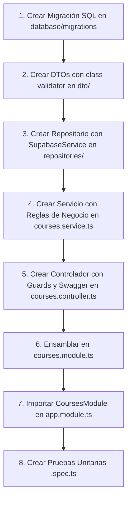

# 🏛️ Guía Maestra de Arquitectura Backend - NestJS 11 & Supabase
**Proyecto: Vamos Aprendiendo Web**

Esta guía explica en profundidad la arquitectura del backend, la razón de ser de cada una de sus carpetas y componentes, cómo crear cada pieza del sistema (controladores, servicios, repositorios, interfaces, middlewares, utilidades, configuración) y el flujo completo paso a paso para implementar una nueva ruta desde cero.

---

## 📑 Tabla de Contenidos
1. [Filosofía y Patrón Arquitectónico](#1-filosofía-y-patrón-arquitectónico)
2. [Estructura y Anatomía de Carpetas: Qué hacen y Por qué existen](#2-estructura-y-anatomía-de-carpetas-qué-hacen-y-por-qué-existen)
3. [Bloques de Construcción: Cómo crear cada elemento](#3-bloques-de-construcción-cómo-crear-cada-elemento)
   - [Interfaces y Entidades (Dominio)](#31-interfaces-y-entidades-dominio)
   - [DTOs (Data Transfer Objects y Validación)](#32-dtos-data-transfer-objects-y-validación)
   - [Repositorios (Capa de Acceso a Datos con Supabase)](#33-repositorios-capa-de-acceso-a-datos-con-supabase)
   - [Servicios (Lógica de Negocio)](#34-servicios-lógica-de-negocio)
   - [Controladores (Capa de Entrada HTTP)](#35-controladores-capa-de-entrada-http)
   - [Middlewares (Pre-procesamiento de Peticiones)](#36-middlewares-pre-procesamiento-de-peticiones)
   - [Utils / Helpers (Funciones Puras Reutilizables)](#37-utils--helpers-funciones-puras-reutilizables)
   - [Shared / Common (Decoradores, Guards, Interceptores, Filtros)](#38-shared--common-decoradores-guards-interceptores-filtros)
   - [Config (Configuración y Variables de Entorno)](#39-config-configuración-y-variables-de-entorno)
4. [Flujo End-to-End: Cómo implementar una nueva ruta completa](#4-flujo-end-to-end-cómo-implementar-una-nueva-ruta-completa)
5. [Pruebas Unitarias (Jest)](#5-pruebas-unitarias-jest)

---

## 1. Filosofía y Patrón Arquitectónico

El backend está construido sobre **NestJS 11** y utiliza una **Arquitectura Modular por Características (Feature-Based Modular Architecture)** combinada con principios de **Clean Architecture**:

- **Desacoplamiento de Responsabilidades:**
  - Los **Controladores** solo reciben solicitudes HTTP, delegan la lógica y devuelven respuestas.
  - Los **Servicios** contienen la lógica del negocio (reglas, cálculos, orquestación).
  - Los **Repositorios / SupabaseService** manejan la persistencia en base de datos.
  - Los **DTOs** validan y transforman la entrada de datos antes de que toque la lógica.
  - Los **Guards** deciden si una petición tiene autorización o rol suficiente.
- **Inyección de Dependencias (IoC / DI):** Todas las piezas se conectan a través del contenedor de inversión de control de NestJS mediante `@Injectable()`.
- **Database-as-a-Service (Supabase):** PostgreSQL gestionado por Supabase, consumido mediante el cliente SDK `@supabase/supabase-js` con credenciales de servicio seguras.

---

## 2. Estructura y Anatomía de Carpetas: Qué hacen y Por qué existen

```text
backend/
├── database/                        # SQL y Esquemas de Base de Datos
│   └── migrations/                  # Scripts SQL de migraciones versionadas (tablas, RLS, triggers)
├── src/                             # Código fuente de TypeScript
│   ├── common/                      # Capa transversal compartida por múltiples módulos
│   │   ├── decorators/              # Decoradores personalizados (@CurrentUser, @Roles)
│   │   ├── enums/                   # Tipos enumerados del dominio (Role: admin, usuario, test)
│   │   ├── guards/                  # Guardianes de seguridad (JwtAuthGuard, RolesGuard, ActiveAccessGuard)
│   │   ├── interceptors/            # Transformación/monitoreo de req/res (LoggingInterceptor)
│   │   ├── filters/                 # Filtros de excepciones globales (HTTP Exception Filters)
│   │   └── pipes/                   # Pipes de validación o transformación personalizada
│   ├── config/                      # Configuración tipada del sistema y variables de entorno
│   ├── modules/                     # Módulos de funcionalidad (Vertical Slices)
│   │   ├── admin/                   # Administración de usuarios, roles y métricas
│   │   ├── auth/                    # Autenticación, JWT, OAuth, Refresh Tokens y registro
│   │   ├── supabase/                # Proveedor singleton de conexión a PostgreSQL / Supabase
│   │   └── telemetry/               # Módulo de métricas y telemetría de la aplicación
│   ├── shared/                      # Utilidades y componentes utilitarios globales
│   │   └── utils/                   # Funciones puras (hashing de tokens, cálculo de fechas)
│   ├── app.controller.ts            # Controlador raíz (Health check de la aplicación)
│   ├── app.module.ts                # Módulo raíz que ensambla toda la aplicación
│   ├── app.service.ts               # Servicio base
│   └── main.ts                      # Punto de entrada (bootstrap): CORS, Pipes, Swagger
├── test/                            # Pruebas End-to-End (E2E) con Supertest
├── .env                             # Variables de entorno secretas (JWT_SECRET, SUPABASE_KEY)
├── package.json                     # Definición de paquetes y scripts npm
└── tsconfig.json                    # Opciones del compilador TypeScript
```

### ¿Por qué existe cada carpeta?
- **`database/migrations/`:** Porque la base de datos debe ser reproducible y versionable en Git. Si otro desarrollador clona el repositorio o montamos un entorno de pruebas, basta con ejecutar estos scripts para replicar las tablas, índices y triggers.
- **`src/common/`:** Evita la duplicación de código (DRY). Si varios controladores necesitan saber el usuario actual o validar roles, esa lógica vive aquí una sola vez.
- **`src/modules/`:** Aplica el principio de alta cohesión y bajo acoplamiento. Cada feature (como `auth` o `admin`) tiene todo lo que necesita para existir (controlador, servicio, DTOs, pruebas) en su propia carpeta.
- **`src/modules/supabase/`:** Centraliza la conexión con el cliente de Supabase. Si mañana cambian las claves o la estrategia de conexión, solo se toca este módulo.

---

## 3. Bloques de Construcción: Cómo crear cada elemento

A continuación se detalla cómo crear cada pieza del sistema con ejemplos aplicados al proyecto.

---

### 3.1. Interfaces y Entidades (Dominio)
**¿Qué es?** Definen el contrato TypeScript y la forma que tienen los datos en la base de datos o en el dominio del negocio.
**Ubicación:** `src/modules/<feature>/entities/` o `src/modules/<feature>/interfaces/`.

**Ejemplo:** `src/modules/courses/entities/course.entity.ts`
```typescript
export interface Course {
  id: string;
  title: string;
  description?: string | null;
  tutorId: string;
  isActive: boolean;
  createdAt: Date;
  updatedAt: Date;
}
```

---

### 3.2. DTOs (Data Transfer Objects y Validación)
**¿Qué es?** Objetos que definen la forma exacta de los datos que viajan por la red en peticiones HTTP (`POST`, `PATCH`). Usan `class-validator` para validar tipos y reglas de negocio antes de llegar al controlador, y `@ApiProperty` para documentarse en Swagger.
**Ubicación:** `src/modules/<feature>/dto/`.

**Ejemplo:** `src/modules/courses/dto/create-course.dto.ts`
```typescript
import { IsString, IsNotEmpty, IsOptional, MaxLength, MinLength } from 'class-validator';
import { ApiProperty, ApiPropertyOptional } from '@nestjs/swagger';

export class CreateCourseDto {
  @ApiProperty({
    description: 'Título descriptivo del curso',
    example: 'Introducción a la Programación',
  })
  @IsString({ message: 'El título debe ser una cadena de texto' })
  @IsNotEmpty({ message: 'El título no puede estar vacío' })
  @MinLength(3, { message: 'El título debe tener al menos 3 caracteres' })
  @MaxLength(120, { message: 'El título no puede superar los 120 caracteres' })
  title: string;

  @ApiPropertyOptional({
    description: 'Descripción del curso',
    example: 'Aprende los fundamentos de la lógica de software.',
  })
  @IsString({ message: 'La descripción debe ser un texto' })
  @IsOptional()
  description?: string;
}
```

---

### 3.3. Repositorios (Capa de Acceso a Datos con Supabase)
**¿Qué es?** En NestJS tradicional con TypeORM o Prisma se usa un repositorio. En nuestro proyecto con Supabase, el patrón Repositorio abstrae las consultas SQL/SDK de Supabase para que los servicios no dependan directamente de la sintaxis de Supabase.
**Ubicación:** `src/modules/<feature>/repositories/` (o dentro de `<feature>.service.ts`).

**Ejemplo:** `src/modules/courses/repositories/courses.repository.ts`
```typescript
import { Injectable, InternalServerErrorException } from '@nestjs/common';
import { SupabaseService } from '../../supabase/supabase.service';
import { Course } from '../entities/course.entity';

@Injectable()
export class CoursesRepository {
  constructor(private readonly supabaseService: SupabaseService) {}

  async findAll(): Promise<Course[]> {
    const { data, error } = await this.supabaseService
      .getClient()
      .from('courses')
      .select('*')
      .order('created_at', { ascending: false });

    if (error) {
      throw new InternalServerErrorException(`Error al consultar cursos: ${error.message}`);
    }

    return (data || []).map(this.mapToEntity);
  }

  async findById(id: string): Promise<Course | null> {
    const { data, error } = await this.supabaseService
      .getClient()
      .from('courses')
      .select('*')
      .eq('id', id)
      .maybeSingle();

    if (error) {
      throw new InternalServerErrorException(`Error al consultar curso: ${error.message}`);
    }

    return data ? this.mapToEntity(data) : null;
  }

  async create(courseData: Partial<Course>): Promise<Course> {
    const { data, error } = await this.supabaseService
      .getClient()
      .from('courses')
      .insert([{
        title: courseData.title,
        description: courseData.description,
        tutor_id: courseData.tutorId,
        is_active: courseData.isActive ?? true,
      }])
      .select()
      .single();

    if (error) {
      throw new InternalServerErrorException(`Error al crear curso: ${error.message}`);
    }

    return this.mapToEntity(data);
  }

  // Mapeador de nombres snake_case de BD a camelCase de TypeScript
  private mapToEntity(row: any): Course {
    return {
      id: row.id,
      title: row.title,
      description: row.description,
      tutorId: row.tutor_id,
      isActive: row.is_active,
      createdAt: new Date(row.created_at),
      updatedAt: new Date(row.updated_at),
    };
  }
}
```

---

### 3.4. Servicios (Lógica de Negocio)
**¿Qué es?** El corazón de la aplicación. Contiene las reglas del negocio: validaciones, cálculos (como el periodo de prueba de 14 días), envío de eventos y orquestación de repositorios.
**Ubicación:** `src/modules/<feature>/<feature>.service.ts`.

**Ejemplo:** `src/modules/courses/courses.service.ts`
```typescript
import { Injectable, NotFoundException, ConflictException } from '@nestjs/common';
import { CoursesRepository } from './repositories/courses.repository';
import { CreateCourseDto } from './dto/create-course.dto';

@Injectable()
export class CoursesService {
  constructor(private readonly coursesRepository: CoursesRepository) {}

  async getAllCourses() {
    return await this.coursesRepository.findAll();
  }

  async getCourseById(id: string) {
    const course = await this.coursesRepository.findById(id);
    if (!course) {
      throw new NotFoundException(`El curso con ID "${id}" no existe.`);
    }
    return course;
  }

  async createCourse(createCourseDto: CreateCourseDto, tutorId: string) {
    // Ejemplo de regla de negocio: validar cursos duplicados
    const existing = await this.coursesRepository.findAll();
    const isDuplicate = existing.some(
      (c) => c.title.toLowerCase() === createCourseDto.title.toLowerCase() && c.tutorId === tutorId
    );

    if (isDuplicate) {
      throw new ConflictException('Ya tienes un curso registrado con este mismo título.');
    }

    return await this.coursesRepository.create({
      title: createCourseDto.title,
      description: createCourseDto.description,
      tutorId,
    });
  }
}
```

---

### 3.5. Controladores (Capa de Entrada HTTP)
**¿Qué es?** Es la interfaz HTTP de la aplicación. Mapea endpoints (`@Get()`, `@Post()`, `@Patch()`, `@Delete()`), asigna códigos de estado (`@HttpCode()`), documenta en Swagger (`@ApiTags()`, `@ApiOperation()`) y protege rutas mediante `@UseGuards()`.
**Ubicación:** `src/modules/<feature>/<feature>.controller.ts`.

**Ejemplo:** `src/modules/courses/courses.controller.ts`
```typescript
import {
  Controller,
  Get,
  Post,
  Body,
  Param,
  UseGuards,
  HttpCode,
  HttpStatus,
} from '@nestjs/common';
import { ApiTags, ApiOperation, ApiResponse, ApiBearerAuth } from '@nestjs/swagger';
import { CoursesService } from './courses.service';
import { CreateCourseDto } from './dto/create-course.dto';
import { JwtAuthGuard } from '../../common/guards/jwt-auth.guard';
import { RolesGuard } from '../../common/guards/roles.guard';
import { ActiveAccessGuard } from '../../common/guards/active-access.guard';
import { Roles } from '../../common/decorators/roles.decorator';
import { CurrentUser } from '../../common/decorators/current-user.decorator';
import { Role } from '../../common/enums/role.enum';

@ApiTags('Courses')
@Controller('courses')
export class CoursesController {
  constructor(private readonly coursesService: CoursesService) {}

  @Get()
  @ApiOperation({ summary: 'Obtener catálogo público de cursos' })
  @ApiResponse({ status: 200, description: 'Listado de cursos disponibles' })
  async findAll() {
    return await this.coursesService.getAllCourses();
  }

  @Get(':id')
  @ApiOperation({ summary: 'Obtener detalle de un curso por ID' })
  @ApiResponse({ status: 200, description: 'Curso encontrado' })
  @ApiResponse({ status: 404, description: 'Curso no encontrado' })
  async findOne(@Param('id') id: string) {
    return await this.coursesService.getCourseById(id);
  }

  @Post()
  @UseGuards(JwtAuthGuard, RolesGuard, ActiveAccessGuard)
  @Roles(Role.ADMIN, Role.USER)
  @ApiBearerAuth()
  @HttpCode(HttpStatus.CREATED)
  @ApiOperation({ summary: 'Crear un nuevo curso (Requiere suscripción o trial activo)' })
  @ApiResponse({ status: 201, description: 'Curso creado exitosamente' })
  @ApiResponse({ status: 401, description: 'No autorizado' })
  @ApiResponse({ status: 403, description: 'Rol insuficiente o periodo de prueba vencido' })
  async create(
    @Body() createCourseDto: CreateCourseDto,
    @CurrentUser() user: any,
  ) {
    return await this.coursesService.createCourse(createCourseDto, user.userId);
  }
}
```

---

### 3.6. Middlewares (Pre-procesamiento de Peticiones)
**¿Qué es?** Funciones que se ejecutan antes de que la petición llegue a los Guards, Interceptores o Controladores. Tienen acceso a `req`, `res` y `next()`. Ideales para adjuntar IDs de correlación, sanitizar cabeceras o limitar tasas de peticiones.
**Ubicación:** `src/common/middlewares/` o en el módulo específico.

**Ejemplo:** Middleware que inyecta un Header de tiempo de solicitud (`RequestTimestampMiddleware`):
```typescript
// src/common/middlewares/request-timestamp.middleware.ts
import { Injectable, NestMiddleware } from '@nestjs/common';
import { Request, Response, NextFunction } from 'express';

@Injectable()
export class RequestTimestampMiddleware implements NestMiddleware {
  use(req: Request, res: Response, next: NextFunction) {
    req['requestStartTime'] = Date.now();
    res.setHeader('X-Server-Time', new Date().toISOString());
    next();
  }
}
```

**Cómo se aplica en un Módulo:**
```typescript
// src/modules/courses/courses.module.ts
import { Module, NestModule, MiddlewareConsumer, RequestMethod } from '@nestjs/common';
import { RequestTimestampMiddleware } from '../../common/middlewares/request-timestamp.middleware';

@Module({ ... })
export class CoursesModule implements NestModule {
  configure(consumer: MiddlewareConsumer) {
    consumer
      .apply(RequestTimestampMiddleware)
      .forRoutes({ path: 'courses', method: RequestMethod.ALL });
  }
}
```

---

### 3.7. Utils / Helpers (Funciones Puras Reutilizables)
**¿Qué es?** Funciones utilitarias determinísticas, sin estado, fáciles de testear.
**Ubicación:** `src/shared/utils/` o `src/common/utils/`.

**Ejemplo:** Funciones para hashing criptográfico de tokens y cálculo de días restantes:
```typescript
// src/shared/utils/date.utils.ts
export function calculateDaysRemaining(targetDate: string | Date | null): number | null {
  if (!targetDate) return null;
  const diffMs = new Date(targetDate).getTime() - Date.now();
  return Math.max(0, Math.ceil(diffMs / (1000 * 60 * 60 * 24)));
}

// src/shared/utils/crypto.utils.ts
import * as crypto from 'crypto';

export function hashTokenSha256(token: string): string {
  return crypto.createHash('sha256').update(token).digest('hex');
}
```

---

### 3.8. Shared / Common (Decoradores, Guards, Interceptores, Filtros)

#### A. Decoradores Personalizados (`src/common/decorators/`)
Extraen datos del contexto HTTP o fijan metadatos:
- `@CurrentUser()`: Extrae el usuario deserializado en `req.user`.
- `@Roles(Role.ADMIN, Role.USER)`: Fija qué roles tienen permiso en el endpoint.

#### B. Guards (`src/common/guards/`)
Determinan si la petición continúa o es rechazada:
- `JwtAuthGuard`: Valida la firma del token.
- `RolesGuard`: Compara los roles anotados en `@Roles()` con el rol de `req.user.role`.
- `ActiveAccessGuard`: Verifica `isActive` y que el periodo de prueba de 14 días no haya expirado para el rol `test`.

#### C. Interceptores (`src/common/interceptors/`)
Transforman la respuesta o miden tiempos. Nuestro [LoggingInterceptor](file:///e:/SENA/Proyecto%20productivo/vamos-aprendiendo-web/backend/src/common/interceptors/logging.interceptor.ts) registra:
`[GET] /api/v1/courses 200 - 12ms`

#### D. Filtros de Excepciones (`src/common/filters/`)
Atrapan errores no controlados y estandarizan el JSON de error hacia el cliente:
```typescript
// src/common/filters/http-exception.filter.ts
import { ExceptionFilter, Catch, ArgumentsHost, HttpException, HttpStatus } from '@nestjs/common';
import { Response } from 'express';

@Catch()
export class GlobalHttpExceptionFilter implements ExceptionFilter {
  catch(exception: unknown, host: ArgumentsHost) {
    const ctx = host.switchToHttp();
    const response = ctx.getResponse<Response>();

    const status =
      exception instanceof HttpException
        ? exception.getStatus()
        : HttpStatus.INTERNAL_SERVER_ERROR;

    const message =
      exception instanceof HttpException
        ? exception.getResponse()
        : 'Error interno del servidor';

    response.status(status).json({
      success: false,
      statusCode: status,
      timestamp: new Date().toISOString(),
      error: message,
    });
  }
}
```

---

### 3.9. Config (Configuración y Variables de Entorno)
**¿Qué es?** Manejo centralizado y tipado de variables de `.env`. En lugar de llamar `process.env.MI_VARIABLE` en cualquier archivo, se utiliza `ConfigService` inyectado.
**Ubicación:** `src/config/`.

**Ejemplo:** `src/config/jwt.config.ts`
```typescript
import { registerAs } from '@nestjs/config';

export default registerAs('jwt', () => ({
  secret: process.env.JWT_SECRET || 'default_secret_key_vamos_aprendiendo',
  expiresIn: process.env.JWT_EXPIRES_IN || '15m',
  refreshExpiresInDays: parseInt(process.env.REFRESH_TOKEN_EXPIRES_IN_DAYS || '7', 10),
}));
```

---

## 4. Flujo End-to-End: Cómo implementar una nueva ruta completa

Para crear un nuevo módulo (por ejemplo, `courses`), sigue este orden exacto:



### Paso 1: Crear la migración en Supabase / PostgreSQL
Crea el script en `database/migrations/20260912_create_courses_table.sql`:
```sql
CREATE TABLE IF NOT EXISTS public.courses (
    id UUID PRIMARY KEY DEFAULT gen_random_uuid(),
    title VARCHAR(150) NOT NULL,
    description TEXT,
    tutor_id UUID NOT NULL REFERENCES auth.users(id) ON DELETE CASCADE,
    is_active BOOLEAN NOT NULL DEFAULT TRUE,
    created_at TIMESTAMP WITH TIME ZONE DEFAULT NOW(),
    updated_at TIMESTAMP WITH TIME ZONE DEFAULT NOW()
);

CREATE INDEX IF NOT EXISTS idx_courses_tutor ON public.courses(tutor_id);
```

### Paso 2: Crear el DTO
Crea `src/modules/courses/dto/create-course.dto.ts` (ver ejemplo en sección 3.2).

### Paso 3: Crear el Repositorio
Crea `src/modules/courses/repositories/courses.repository.ts` (ver ejemplo en sección 3.3).

### Paso 4: Crear el Servicio
Crea `src/modules/courses/courses.service.ts` (ver ejemplo en sección 3.4).

### Paso 5: Crear el Controlador
Crea `src/modules/courses/courses.controller.ts` (ver ejemplo en sección 3.5).

### Paso 6: Crear el Módulo
Crea `src/modules/courses/courses.module.ts`:
```typescript
import { Module } from '@nestjs/common';
import { CoursesController } from './courses.controller';
import { CoursesService } from './courses.service';
import { CoursesRepository } from './repositories/courses.repository';
import { SupabaseModule } from '../supabase/supabase.module';

@Module({
  imports: [SupabaseModule],
  controllers: [CoursesController],
  providers: [CoursesService, CoursesRepository],
  exports: [CoursesService],
})
export class CoursesModule {}
```

### Paso 7: Registrar en `AppModule`
En `src/app.module.ts`:
```typescript
import { CoursesModule } from './modules/courses/courses.module';

@Module({
  imports: [
    ConfigModule.forRoot({ isGlobal: true, envFilePath: '.env' }),
    SupabaseModule,
    AuthModule,
    AdminModule,
    CoursesModule, // <-- ¡Listo!
  ],
  // ...
})
export class AppModule {}
```

---

## 5. Pruebas Unitarias (Jest)

En este proyecto, cada servicio debe tener su prueba unitaria simulando (`mocking`) las llamadas a Supabase.

**Ejemplo:** `src/modules/courses/courses.service.spec.ts`
```typescript
import { Test, TestingModule } from '@nestjs/testing';
import { CoursesService } from './courses.service';
import { CoursesRepository } from './repositories/courses.repository';
import { ConflictException } from '@nestjs/common';

describe('CoursesService', () => {
  let service: CoursesService;
  let repository: Partial<CoursesRepository>;

  beforeEach(async () => {
    repository = {
      findAll: jest.fn().mockResolvedValue([
        { id: '1', title: 'Curso Existente', tutorId: 'tutor-123' },
      ]),
      create: jest.fn().mockImplementation((dto) => Promise.resolve({ id: '2', ...dto })),
    };

    const module: TestingModule = await Test.createTestingModule({
      providers: [
        CoursesService,
        { provide: CoursesRepository, useValue: repository },
      ],
    }).compile();

    service = module.get<CoursesService>(CoursesService);
  });

  it('debería rechazar un curso duplicado para el mismo tutor', async () => {
    await expect(
      service.createCourse({ title: 'Curso Existente' }, 'tutor-123')
    ).rejects.toThrow(ConflictException);
  });

  it('debería permitir crear un curso con título nuevo', async () => {
    const result = await service.createCourse({ title: 'Curso Nuevo' }, 'tutor-123');
    expect(result.id).toBe('2');
    expect(result.title).toBe('Curso Nuevo');
  });
});
```

Para ejecutar todas las pruebas y verificar que pasen al 100%:
```bash
npm run test
```
